# DemoDapp

This repo is sample dapp for Wallet Link SDK. 

WalletLink is an open protocol that lets users connect their mobile wallets to your DApp.

With the extend WalletLink SDK, your mobile dapp will be able to interact with mobile wallets and be able to sign web3 transactions and messages.

For more info check our extended [SDK](https://github.com/Zxu49/walletlink-mobile-sdk/tree/master/android)

The origin [repo](https://github.com/walletlink/walletlink-mobile-sdk)

### Dapp Side

Init the instance like wallet side
```
    val walletLink = WalletLink(notificationUrl, context)
```

1. Generated secret and session id into QR code, and established websocket to bridge server

```
    // This will connect to wallet link server using websocket
    // data is JSON RPC for establish host session, more info see our example format
    // session Id is 32 width randomly generated alphabet string 
    // secret is 64 width randomly generated alphabet string 

    walletLink.sendHostSessionRequest(data, sessionID, secret)
```

2. Using observable mode listing the response from connected socket

```
    walletLink.responseObservable
        .observeOn(serialScheduler)
        .subscribe { 
        // get socket response from socket
        }.addTo(disposeBag)
```
3. Using observable mode listing the address from connected socket

```
    walletLink.addressObservable
        .observeOn(serialScheduler)
        .subscribe {
        // get socket address from socket
        }
        .addTo(disposeBag)
```

4. Send personal string to bridge sever, then pass it to connected wallet  
```
    // data JsonRPCRequestPersonalDataDTO class encrypted by secret using AES
    val data = JSON.toJsonString(jsonRPC).encryptUsingAES256GCM(secret)
    walletLink.sendSignPersonalData(data, sessionID)
```

5. Send typed data (JSON-RPC) to bridge sever, then pass it to connected wallet  
```
    // data JsonRPCRequestTypedDataDTO class encrypted by secret using AES
    val data = JSON.toJsonString(jsonRPC).encryptUsingAES256GCM(secret)
    walletLink.sendSignTypedData(data, sessionID)
```

6. Submit the Transaction request to bridge sever, then pass it to connected wallet  

```
    // data JsonRPCRequestTransactionDataDTO class encrypted by secret using AES
    // the data will be wrapped inside the PublishEventDTO
    val data = JSON.toJsonString(jsonRPC).encryptUsingAES256GCM(secret)
    walletLink.sendStartTransaction(data,sessionID,secret)  
```

7. Cancel the previous the Transaction request to bridge sever, then pass it to connected wallet  

```
    // data JsonRPCRequestCancelDataDTO class encrpted by secret using AES
    // the data will be wrapped inside the PublishEventDTO
    val data = JSON.toJsonString(jsonRPC).encryptUsingAES256GCM(secret)
    walletLink.sendCancel(data,sessionID,secret)

```

## Use Cases and User Interface Flow
Users may expect to use our library if they want to build a mobile Dapp

1. To connect to the wallet, dapp users can click the ‘start connection’ button. Then it will generate a QR code with the Session ID and Session Key parameters (Figure 3.3.1)

     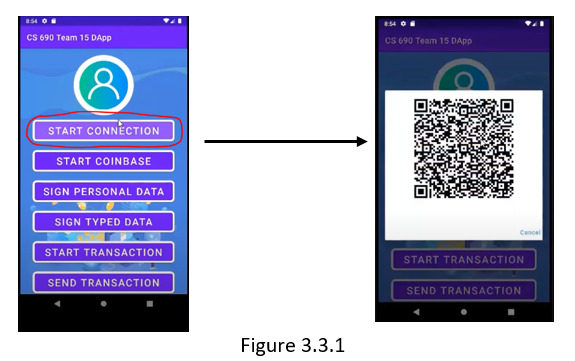
    
2. Wallet users can click the ‘Connect to app’ button to scan the QR code(Figure 3.3.2)

    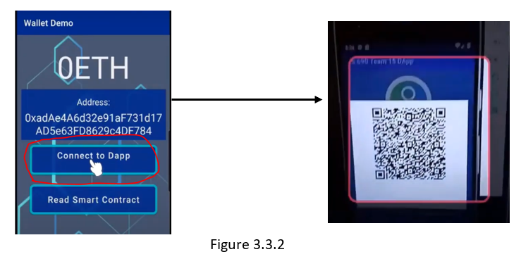 

3. After that, the wallet user can click ‘link’ in the new pop-up to send a connection request to Dapp (Figure 3.3.3)

    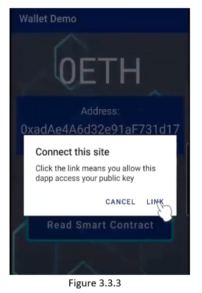
   
4. When the Dapp receives the connection request, it will send a new permission request to the wallet again (Figure 3.3.4)

    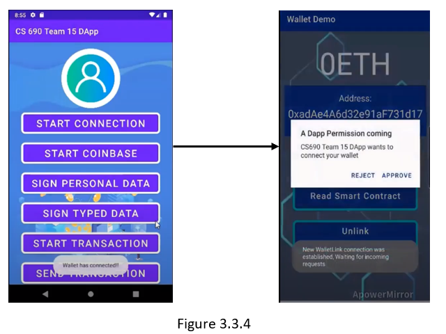
   
5. The wallet user can select ‘approve’ in the incoming dialog to connect to dapp and dapp will show the fetched wallet address (Figure 3.3.5)

    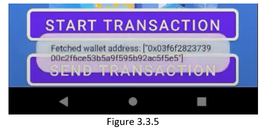
   
6. The dapp right now can send encrypted signed personal data string to the wallet through the bridge server, the wallet will decrypt the string and the user can choose whether to Approve or Reject it (Figure 3.3.6)

    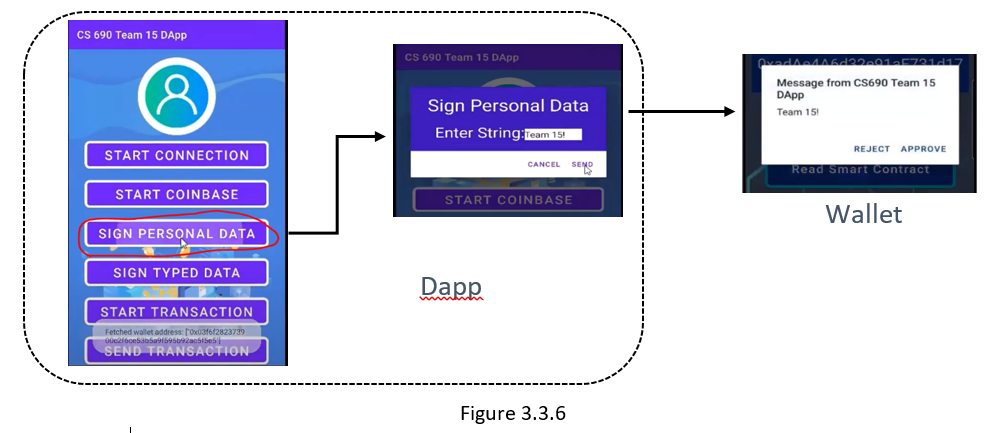
   
7. Once the wallet approves or rejects the payload requests, a notification message will send back to the dapp (Figure 3.3.7)

    

8. The ‘sign typed data’ performs similar functionalities except that it sends encrypted structural data instead of the data string. When dapp users click the ‘sign typed data’ button, a form dialog will pop out and users can customize the parameters (Figure 3.3.8)

    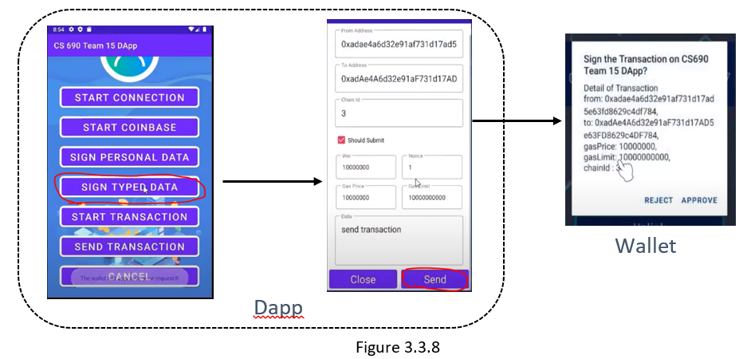
   
9. Then dapp will send the signed transaction data from the last step, along with the blockchain network information to the wallet and the wallet can process the transaction (Figure 3.3.9)

    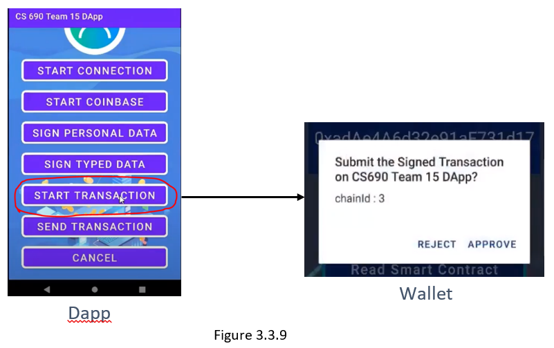
    
10. The dapp can send a greeting message to a smart contract on the Rinkeby testnet according to the contract address the user input. Then the testnet will send a status back indicating whether the transaction is successful, and the gas used (Figure 3.3.10)

    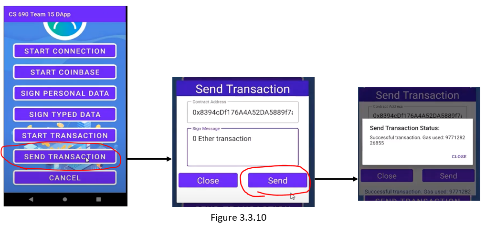
    
11. The wallet users can click ‘Read Smart Contract’ to read the greeting message of the smart contract by the contract’s address (Figure 3.3.11)

    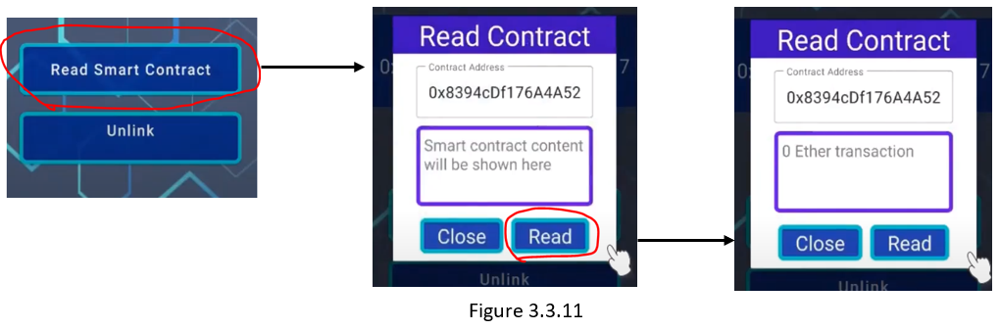
    
12. Lastly, the dapp user can click the “Cancel” button to send a disconnection request to the wallet to terminate the connection with the wallet (Figure 3.3.12)

    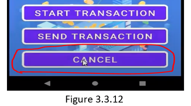
    
13. A new dialog will pop out on the wallet side and the user can select ok in the dialog and click the ‘Unlink’ button to disconnect with dapp (Figure 3.3.13)

    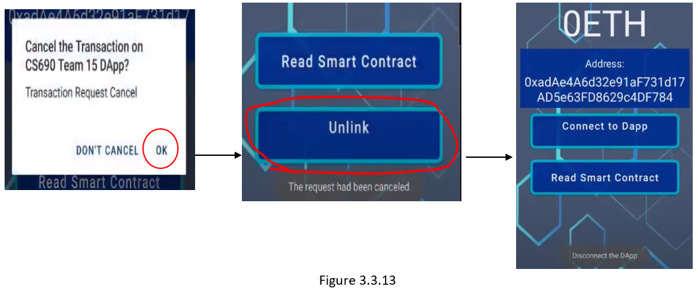

### For the Coinbase Wallet users:

14. Coinbase Wallet users can click the ‘start coinbase’ button on the dapp and it will pop a new QR code that allows Coinbase Wallet to scan for connecting with it (Figure 3.3.14)

    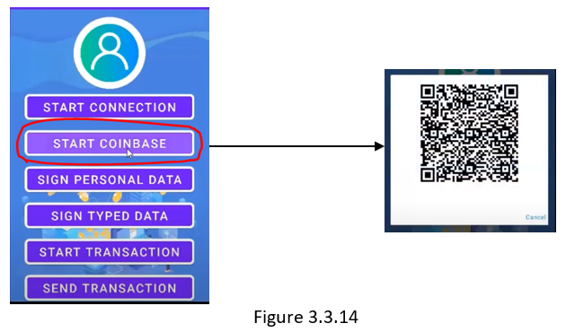
    
15. Users of coinbase wallet can scan the QR code and connect with our dapp and dapp will also show the wallet address it fetched (Figure 3.3.15)

    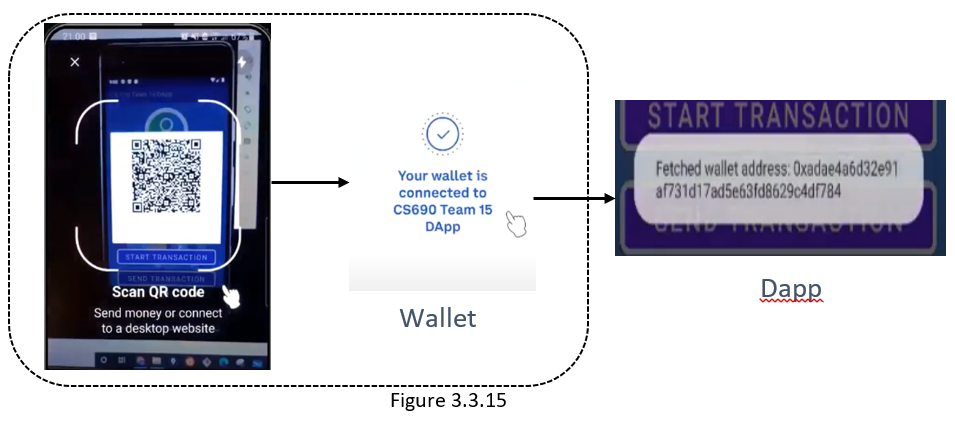
    
16. Then we can send a new Sign Personal data message to the coinbase wallet. When the payload is sent to the coinbase wallet successfully, a new signature request prompt will pop out in the Coinbase wallet and users can sign this message (Figure 3.3.16)

    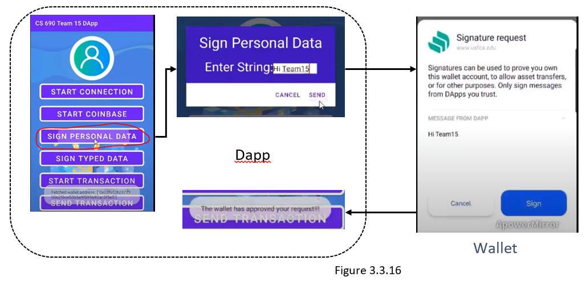
    
17. After sending the sign personal data, users can send sign typed data to coinbase. After receiving the sign typed data successfully and the Confirm Payment prompt pops out, the user can click the confirm button to confirm this sign typed data payment (Figure 3.3.17)

    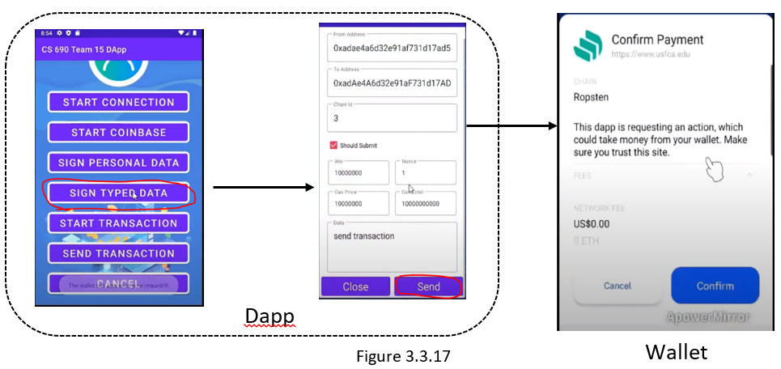
